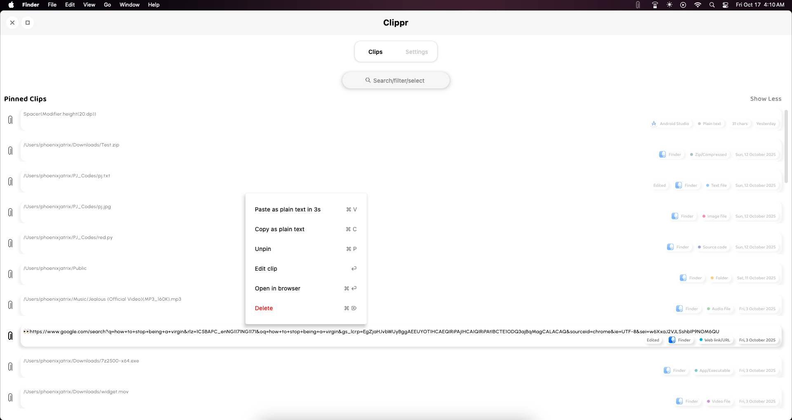
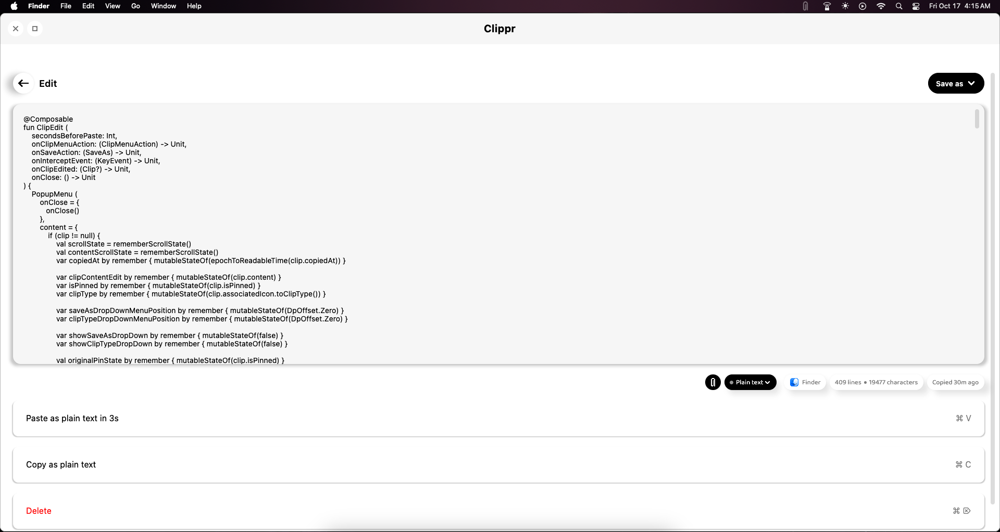
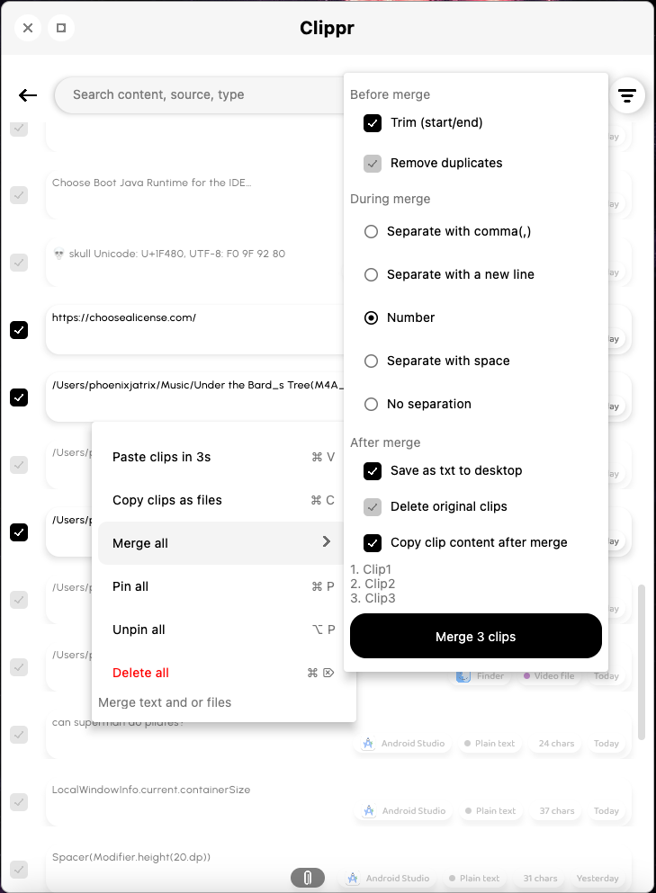
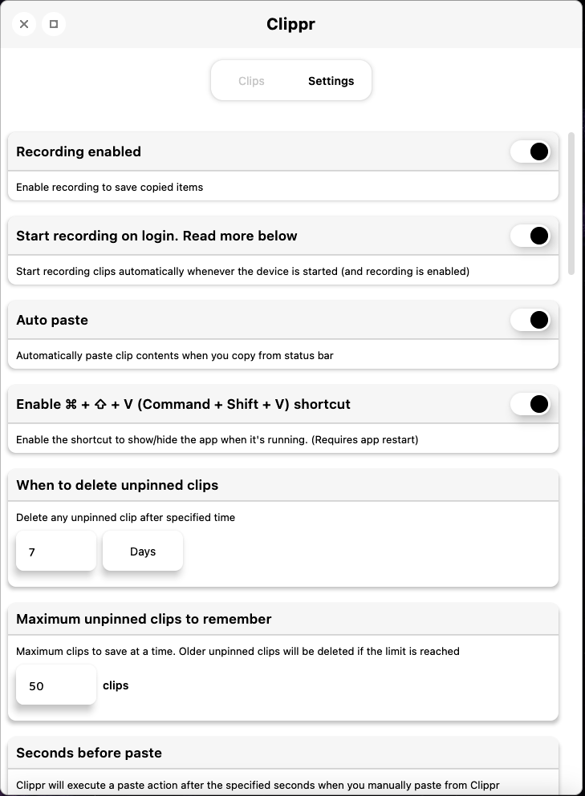
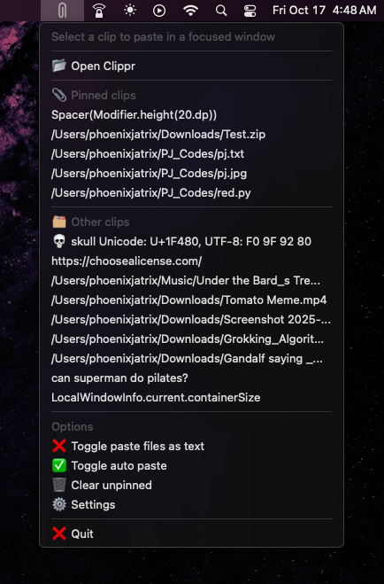

# 🧷 Clippr

**Clippr** is a minimalist clipboard manager built for macOS.  
It saves everything you copy on device and let's you paste them directly from the menu bar or the main app

---

## 🚀 Features

### 📋 Clipboard History
Automatically captures everything you copy. Quickly access your recent clips from the tray icon or main window.

### 📌 Pinned Clips
Keep your most important clips at the top for instant access.  


### ✏️ Edit Clips
Edit your clip content and change associated type if incorrectly categorized 


### 🔍 Search & Merge
Search your clipboard history, filter and select multiple clips to **merge** into one, **paste** or **copy**


### ⚙️ Settings
Customize how Clippr behaves, when to delete clips, when to start copying, maximum clips to copy at a time...  


### 🚫 Exceptions
Exclude certain apps or content types from being saved to help you control what Clippr saves


### 🧠 Tray Menu
Access your clips pinned clips, settings, and quick actions right from the macOS menu bar.  


### ⚡️ Accessibility 
Clippr supports intuitive shortcuts in app that lets you access your clips without having to move those crusty hands to the mouse

---

### 🔒 Privacy

Your privacy is core to Clippr’s design.

🗄️ All clips are stored locally on your device — nothing leaves your computer.

❌ No cloud sync, telemetry, or analytics.

🔐 You control what gets saved and can clear history anytime.

### 🧰 Tech Stack

Kotlin (JVM)

JetBrains Compose Desktop

JNA interop

Room DB for storage

### 📜 License

MIT License © 2025 Phoenix Jatrix.
Feel free to modify with attribution.

---

## 🧩 Cloning & Running

```bash
# Clone the repository
git clone https://github.com/phoenixjatrix/clippr.git

# Open the project directory
cd clippr

# Build and run (Gradle)
./gradlew run